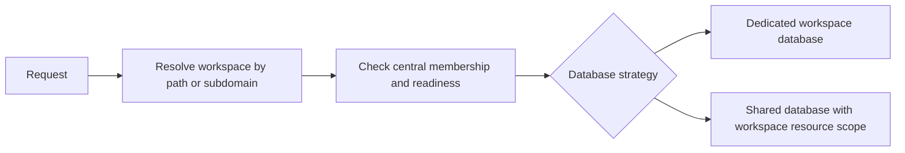

# Lona Tenancy

[](https://www.php.net/)
[](https://laravel.com/)
[](https://filamentphp.com/)
[](https://packagist.org/packages/jhayao/lona-tenancy)
[](LICENSE)

**Dedicated database workspaces for Filament 5.** Give each customer a workspace they can manage, with queued provisioning and workspace-aware access built around Laravel and the public `stancl/tenancy` package.

Lona Tenancy handles workspace setup, membership, provisioning and database context. Choose a dedicated database per workspace or a shared database with resource scoping. With dedicated databases, each workspace has its own `tenant_{slug}` database and integer ID; tenant tables do not need a `tenant_id` column.

## What it includes

| Workspace experience | Operations | Integrations |
| --- | --- | --- |
| Onboarding, searchable switcher, profiles, memberships and invitations | Queued setup, retries, database pools and operator commands | Custom domains, Filament Shield, billing and resource syncing |

## How a request reaches a workspace



## Choose your setup

| If you are… | Start with… |
| --- | --- |
| Adding workspaces to a new tenancy setup | [Installation](#install-in-an-application) |
| Adding memberships to a Filament app that already owns tenancy | [External Filament tenancy preset](#external-filament-tenancy-preset) |
| Configuring invitations, roles or Shield | [Members and permissions](#members-invitations-and-permissions) |

<details>
<summary>On this page</summary>

- [Before you start](#before-you-start)
- [Install in an application](#install-in-an-application)
  - [Install the package](#install-the-package)
  - [Publish configuration and migrations](#publish-configuration-and-migrations)
  - [Database connections](#database-connections)
  - [User model](#user-model)
  - [Panel and resources](#panel-and-resources)
  - [Create your first workspace](#create-your-first-workspace)
  - [Panel options](#panel-options)
  - [Custom domains](#custom-domains-on-laravel-cloud-and-cloudflare)
  - [Custom tenant model](#custom-tenant-model)
  - [Database pools, billing and resource syncing](#database-pools-billing-and-resource-syncing)
  - [Queue and retries](#queue-and-retries)
- [Members, invitations, and permissions](#members-invitations-and-permissions)
  - [Authentication](#authentication)
  - [Roles and service APIs](#roles-and-service-apis)
  - [Seat limits and personal teams](#seat-limits-and-personal-teams)
  - [Filament Shield](#filament-shield)
  - [External Filament tenancy preset](#external-filament-tenancy-preset)
  - [Events, publishing, and cleanup](#events-publishing-and-cleanup)
- [Isolation boundaries](#isolation-boundaries)
- [Customize and test](#customize-and-test)

</details>

## Before you start

| Requirement | Supported versions |
| --- | --- |
| PHP | 8.3 or later |
| Laravel | 12 or 13 |
| Filament | 5 with Livewire 4 |
| Database | SQLite, MySQL/MariaDB or PostgreSQL supported by Stancl |

> [!WARNING]
> Use this package for a new Stancl tenancy setup. It owns the tenant model and database/queue bootstrappers, so do not register another tenancy provider or run `tenancy:install`. Database creation also needs the right privileges for your chosen database server.

The package is a Composer library, not a runnable Laravel application. Install it from [Packagist](https://packagist.org/packages/jhayao/lona-tenancy); it uses the public `stancl/tenancy` v3.10 dependency. Path routing keeps login and workspaces on one origin (for example, `/admin/workspaces/acme`); subdomain routing is also available with `identification => 'subdomain'`. The package retains the Lona namespace and implements its behavior independently.

## Install in an application

### Install the package

Install the latest stable release from Packagist:

```bash
composer require jhayao/lona-tenancy:^0.8
```

To install the latest development branch instead, register the Git repository and require `dev-main`:

```bash
composer config repositories.lona-tenancy vcs https://github.com/jhayao/lona-tenancy.git
composer require jhayao/lona-tenancy:dev-main
```

### Publish configuration and migrations

Then publish the package configuration and migrations in the application:

```bash
php artisan vendor:publish --tag=filament-tenancy-config
php artisan vendor:publish --tag=filament-tenancy-migrations
php artisan migrate
mkdir -p database/migrations/tenant
```

> [!IMPORTANT]
> Migrations must be published and run explicitly in production. Central migrations contain users, memberships, sessions, jobs, failed jobs and database-cache tables. Put only workspace business tables in `database/migrations/tenant`; never copy the central users migration there.

Central migrations are published by default for existing applications. Set `run_migrations => true` only when the package should load its bundled central migrations automatically; do not enable it while also publishing those same migrations.

### Database connections

Set `TENANCY_CENTRAL_CONNECTION` to your named central connection (defaults to `DB_CONNECTION`). New dedicated workspaces use the `tenant_` prefix followed by the workspace slug; set `TENANCY_DATABASE_NAME_PREFIX` to change it. Keep slugs stable after provisioning because the database name is stored with the workspace.

SQLite workspace files are created in the application's `database` directory, which must be writable. MySQL and PostgreSQL credentials need database-creation privileges. To use a separate server/template connection, publish Stancl's config without its installer:

```bash
php artisan vendor:publish --provider='Stancl\Tenancy\TenancyServiceProvider' --tag=config
```

Set `tenancy.database.template_tenant_connection` to a configured connection name. The connection name `tenant` is reserved for the dynamic connection.

### User model

Add `HasTenants` and `HasWorkspaces` to your existing user model. Keep your application's existing `FilamentUser::canAccessPanel()` authorization:

```php
use Filament\Models\Contracts\HasTenants;
use Liern\FilamentTenancy\Concerns\HasWorkspaces;

class User extends Authenticatable implements HasTenants // retain other existing interfaces
{
    use HasWorkspaces; // retain other existing traits
}
```

The trait pins the user model to the central connection and implements membership checks. Set `filament-tenancy.user_model` when your user model isn't `App\Models\User`. The membership table supports numeric, UUID and ULID user keys. If users are deleted, your application should remove their `workspace_user` rows; the package does not add a foreign key to an application-owned user table.

### Panel and resources

In the existing authenticated panel provider:

```php
use Liern\FilamentTenancy\TenancyPlugin;

return $panel
    // Keep your normal id, path, login, middleware, resources and pages.
    ->plugin(TenancyPlugin::make());
```

Tenant resources must extend the provided base class:

```php
use Liern\FilamentTenancy\Resources\TenantResource;

class ProjectResource extends TenantResource
{
    // Your normal Filament v5 resource definition.
}
```

Alternatively declare `protected static bool $isScopedToTenant = false;` on each dedicated resource. The plugin checks this because Filament's default relationship scoping expects a tenant relationship, which dedicated database models do not have. Do not reuse these resource classes in a shared-database tenant panel. Business models should use Laravel's default connection (do not hardcode the central connection). Keep central administration in a separate panel.

### Create your first workspace

Visit `/admin` (or your panel's configured path), sign in, and create a workspace. Existing users can create additional workspaces from the switcher.

Filament's tenant creation policy is respected. Define a policy for `Liern\FilamentTenancy\Models\Tenant` to restrict signup.

### Panel options

The published configuration supplies application defaults. Fluent calls override them for that panel only:

```php
TenancyPlugin::make()
    ->routePrefix('teams')
    ->withTenantRegistration(App\Filament\Pages\RegisterOrganization::class)
    ->withTenantMenu()
    ->withTenantSwitcher()
    ->searchableTenantMenu()
    ->extraTenantMiddleware([App\Http\Middleware\AuditTenantAccess::class]);
```

| Configuration key | Fluent method | Default |
| --- | --- | --- |
| `run_migrations` | config only | `false` |
| `database_strategy` | `databaseStrategy('dedicated' | 'shared')` | `dedicated` |
| `central_domain` | `centralDomain('example.com')` | host from `APP_URL` |
| `identification` | `identification('path' | 'subdomain')` | `path` |
| `route_prefix` | `routePrefix('teams')` | `workspaces` |
| `onboarding.enabled`, `onboarding.page` | `withTenantRegistration(Page::class)` | enabled |
| `registration_page` | `withTenantRegistration(Page::class)` | `RegisterWorkspace::class` |
| `menu.enabled` | `withTenantMenu(false)` | `true` |
| `menu.switcher_enabled` | `withTenantSwitcher(false)` | `true` |
| `menu.searchable` | `searchableTenantMenu(false)` | `true` |
| `menu.items` | `tenantMenuItems([...])` | `[]` |
| `ownership_relationship` | `ownershipRelationship('team')` | `null` |
| `scope_resources_to_tenant` | `scopeResourcesToTenant()` | follows database strategy |
| `profile.*` | `withTenantProfile()` | enabled by published config |
| `billing.*` | `withTenantBilling(...)` | disabled |
| `database_pool.*` | `databasePool([...])` | disabled |
| `resource_syncing.*` | `syncResources([...])` | disabled |
| `extra_tenant_middleware` | `extraTenantMiddleware([...])` | `[]` |

Use `withTenantRegistration(null)` (or `registration_page => null`) to remove self-service registration and its menu entry. Existing memberships remain usable. A replacement registration page must extend Filament's `RegisterTenant`; extend this package's `RegisterWorkspace` to retain its provisioning behavior. Route prefixes must be a single lowercase URL segment, such as `teams` or `client-workspaces`.

Additional middleware runs after membership/readiness checks and persists across Livewire updates. It also runs on the setup page, which remains in central context, so middleware must handle that case. Fluent middleware arrays replace the configured list. Hiding the menu or switcher changes navigation only; it does not authorize access.

The equivalent nested key is `middleware.extra`. `database_strategy => 'dedicated'` uses connection isolation; `database_strategy => 'shared'` uses the `workspace_id` relationship scope for resources that extend `TenantResource`. Set `scope_resources_to_tenant` explicitly when the strategy default is not appropriate.

Use `ownershipRelationship('team')` when tenant-owned resource models expose a relationship other than Filament's default. Menu actions can be supplied with `tenantMenuItems([...])`; closures and action objects should be configured fluently rather than placed in cached config.

Enable the workspace profile page with `profile.enabled => true` or the fluent `withTenantProfile()` option. Owners can edit the workspace name, logo, description, email and phone number. Profile fields are stored in the existing workspace `data` JSON column. Logos are stored under a workspace-specific directory on `profile.logo_disk` (the default is the public disk); use a persistent object-storage disk in production when application instances are ephemeral.

### Custom domains on Laravel Cloud and Cloudflare

Custom domains are opt-in and require subdomain identification. Configure the central host, run the published migrations, and enable the feature in the panel:

```php
// config/filament-tenancy.php
'identification' => 'subdomain',
'central_domain' => env('TENANCY_CENTRAL_DOMAIN', 'app.example.com'),
'custom_domains' => [
    'enabled' => true,
],
```

```php
TenancyPlugin::make()
    ->customDomains();
```

Workspace owners add a hostname from the Custom domains page. The package displays a TXT record at `_lona-verify.<hostname>` and verifies it before the hostname can identify a workspace. Removing a row immediately disables routing for that hostname. Existing domain rows remain unverified after the additive migration.

> [!NOTE]
> This package verifies domain ownership and resolves a verified host. It does not register hostnames with Laravel Cloud or Cloudflare, configure DNS, or issue certificates. Complete those steps with your hosting provider.

Register each verified hostname in Laravel Cloud's Network settings, then add the DNS records Laravel Cloud provides. If Cloudflare hosts the DNS, follow its proxy and SSL requirements for the Laravel Cloud origin. Keep the app behind HTTPS and configure Laravel's trusted proxies for your deployment.

Authentication remains anchored to the central application host. If a user opens a verified custom host without its host-only session cookie, the package sends them through the panel's normal login and MFA/email-verification flow, then issues a one-use handoff valid for 60 seconds.

The handoff is bound to the verified workspace, panel, guard, user, target host and browser network/user-agent state; it never accepts an arbitrary return URL. Do not set `SESSION_DOMAIN` to a parent domain shared with customer domains.

See [Laravel Cloud custom domains](https://laravel.com/cloud/docs/domains), [Cloudflare custom hostnames](https://developers.cloudflare.com/cloudflare-for-platforms/cloudflare-for-saas/domain-support/create-custom-hostnames/), and [the package custom-domain workflow](https://packstub.dev/docs/filament-tenancy/custom-domains) for the hosting and DNS steps outside this package.

For custom-domain handoff behavior, `custom_domains.handoff_ttl` is clamped to 1–120 seconds, `custom_domains.handoff_path` controls the exchange endpoint, and `custom_domains.interstitial` shows a confirmation page before the one-use handoff is consumed. Set `manage_session_cookie => true` in subdomain mode to share the session cookie across the central host and its tenant subdomains while keeping custom domains host-only.

### Custom tenant model

Set the application-wide `tenant_model` configuration to a concrete subclass of the package model:

```php
namespace App\Models;

class Organization extends \Liern\FilamentTenancy\Models\Tenant
{
    // Add application-specific behavior here.
}
```

```php
// config/filament-tenancy.php
 'tenant_model' => App\Models\Organization::class,
```

The same model is used by Filament, Stancl, memberships, validation, provisioning, retries and the setup page. It is configured globally so workers do not depend on a panel being booted. Keep the inherited `workspaces` / `workspace_user` schema, integer workspace IDs, status cast and central connection behavior. Custom tables and alternate key layouts are outside this extension contract. Register authorization policies for your configured model.

Existing published configuration files can omit the new keys: defaults preserve `/workspaces/{slug}`, the existing registration page and searchable switcher. No schema migration is required. PostgreSQL membership reads explicitly cast application-owned user keys to text to match the existing string membership keys.

### Database pools, billing and resource syncing

Database pools are disabled by default. Configure ordinary `database.php` connection names and choose `least-tenants`, `round-robin`, or `weighted` placement:

```php
'database_pool' => [
    'enabled' => true,
    'connections' => ['tenant_pool_1', 'tenant_pool_2'],
    'strategy' => 'least-tenants',
    'weights' => [],
],
```

The fluent equivalent is `databasePool(['tenant_pool_1', 'tenant_pool_2'], strategy: 'least-tenants')`. Pool configuration is validated when the provider boots. Inspect placement with `php artisan tenants:pool`; the original flat connection-list format remains accepted for compatibility.

Billing delegates to Filament's `BillingProvider` contract. Use `withTenantBilling(Provider::class, routeSlug: 'billing', required: true)` or configure `billing.provider`, `billing.route_slug`, and `billing.required`. A required provider must return a non-empty subscribed middleware class.

Resource syncing is opt-in and uses Stancl's `Syncable`/`SyncMaster` contracts with the `SyncsToTenants` and `IsTenantResource` helpers. Configure central-to-tenant model pairs under `resource_syncing.pairs`, or call `syncResources([...])`; add `queueResourceSync()` when fan-out should run through the queue. Models remain responsible for implementing the contracts and declaring their synced attributes.

### Queue and retries

Use an asynchronous queue in production so workspace creation does not hold up signup:

```dotenv
TENANCY_QUEUE_CONNECTION=database
```

```bash
php artisan queue:work database --timeout=300
php artisan workspaces:retry WORKSPACE_ID
```

> [!IMPORTANT]
> Create Laravel's queue tables centrally when using the database queue. For multiple workers, use shared cache with atomic-lock support. Set `retry_after` (or the visibility timeout) above both the job timeout (300 seconds) and lock expiry (360 seconds); 420 seconds is an example.

The job retries up to three times, with 30/120-second backoff. Synchronous queues are useful locally, but provisioning then finishes during signup instead of in the background.

Retries reuse the existing database and run outstanding migrations. Ready workspaces are no-ops. The retry command also recovers a workspace left in provisioning after a killed worker; overlapping queued attempts are serialized by a cache lock. Configure `filament-tenancy.seeder` only with a tenant-safe, idempotent seeder: a failed seeder can run again. Database deletion is deliberately not coupled to model deletion.

Setup failures remain closed to business resources. The browser shows a generic error; Laravel handles exceptions through normal worker logging and failed-job handling. Credentials and raw SQL errors are not shown to members. Requeue pending workspaces if queue dispatch was interrupted after the central transaction committed.

## Members, invitations, and permissions

Publish and run the additive central migration before enabling membership management:

```bash
php artisan vendor:publish --tag=filament-tenancy-teams-config
php artisan vendor:publish --tag=filament-tenancy-teams-migrations
php artisan vendor:publish --tag=filament-tenancy-notifications-migration
php artisan migrate
```

The notification creation migration leaves an existing `notifications` table untouched. New PostgreSQL tables use a `json` data column, as required by Filament's notification filters; other database drivers retain `text`. The included repair migration converts existing PostgreSQL notification payloads to `json`, preserving their data and metadata, and skips tables already using `json` or `jsonb`.

For UUID/ULID users, the `notifiable_id` column must support your user keys. The package writes notifications centrally and enables Filament's notification bell. A central notification relationship is supplied dynamically when the configured user model has none; a host-provided relationship is preserved and should use the central connection.

If notifications were already migrated with v0.5.0, updating the package alone does not change the existing column. After installing the package version containing this fix, publish only the repair migration and run it in the host application:

```bash
php artisan vendor:publish --tag=filament-tenancy-notifications-upgrade
php artisan migrate
```

The repair uses `teams.connection`, falling back to `filament-tenancy.central_connection`, and never runs automatically on an HTTP request. It skips non-PostgreSQL databases and missing notification tables/columns. Invalid JSON causes the conversion to fail atomically; repair the affected payloads in your application and rerun the migration rather than deleting notifications. Rolling back the migration or package code keeps the compatible JSON column intact. No vendor edits or notification-table recreation are needed.

```php
TenancyPlugin::make()->withMembers();
```

Alternatively set `teams.enabled => true`. Every member can view the Members page. Owners manage managers and transfer ownership; managers invite and manage ordinary members. A last owner must transfer ownership before leaving. Existing `is_owner` flags remain compatible with profile and domain authorization. Transfers make the recipient owner and the previous owner manager.

The Members page uses Filament v5 schema/stat components and scoped row styles included with the view. It works with the default Filament theme without a Tailwind build or additional `@source` entries. If you override the view and add Tailwind utilities, include your override directory in your custom theme's `@source` scan and rebuild that theme.

Email invitations support multiple addresses, expiry, resend, revoke and copy-link. Existing accounts receive a database notification as well as email. Mail uses the application's configured mailer and is sent after the invitation transaction commits. Configure a working mail transport. Resend explicitly retries delivery and rotates the URL; duplicate invitations neither send another email nor reserve another seat. Bulk results report individual validation/capacity errors.

Shareable links have a role, expiry and use limit. Email invitations reserve seats; shareable links consume seats only when accepted. All mutation entrypoints serialize against the central team row. The Members page hides management controls from ordinary members and disables new invitations when full; server-side authorization and capacity checks also apply.

Workspace owners can impersonate another member from the Members page. The action is limited to members of the current workspace, respects the target model's optional `canBeImpersonated()` method, and is unavailable to managers and while already impersonating. Filament's impersonation banner is registered automatically. If the app also serves non-Filament pages, add `<x-impersonate::banner/>` to those Blade layouts so the user can see and leave impersonation.

### Authentication

The panel's standard Filament login and registration pages are automatically replaced with invitation-aware subclasses. Registration must already be enabled with `->registration()`; the package does not enable public signup itself. Invited email addresses are prefilled, read-only, and checked server-side. Opening a link as a guest stages it in the central session. Membership is added only after authentication completes, including MFA. Signed-in users confirm with a CSRF-protected POST.

Custom authentication pages are preserved. Extend `Liern\FilamentTenancy\Teams\Auth\Login` / `Register`, or reuse `LocksInvitationEmail`, calling `enforceInvitationEmail()` from your login credential and registration data hooks. The standard Laravel `Login` and `Verified` events drive continuation and verified-account automatic acceptance. Custom auth flows must emit `Login` only after their complete authentication/MFA process. Invitation endpoints use the configured central domain and existing workspace provisioning/custom-domain redirects.

Automatic acceptance on login requires `hasVerifiedEmail()` to return true. A valid email invitation URL proves email possession for that invitation without marking the account globally verified. Shareable links are not email-bound. Wrong-email sessions cannot accept email invitations. Set `teams.auto_accept => false` to disable acceptance of other matching pending invitations while retaining opened-link continuation.

### Roles and service APIs

Configure Jetstream-style definitions in `config/teams.php`:

```php
'roles' => [
    'manager' => ['name' => 'Manager', 'permissions' => ['reports.view']],
    'member' => ['name' => 'Member', 'permissions' => ['reports.view']],
],
'manager_roles' => ['manager'],
'manager_assignable_roles' => ['member'],
```

`owner` is reserved and cannot be invited or assigned by ordinary role changes. Only `initializeOwner()` for an empty team and `transferOwnership()` grant ownership. Keep a `manager` role available for ownership transfers. Management capabilities derive from `manager_roles`; `manager_assignable_roles` cannot grant ownership or a configured manager role. Other permission names come from role definitions, with `*` supported. Owners have all team permissions in the built-in provider.

```php
use Liern\FilamentTenancy\Teams\Teams;
use Liern\FilamentTenancy\Teams\Invitations;

$teams = app(Teams::class);
$teams->members($team)->get();
$teams->forUser($user)->get();
$teams->hasTeamPermission($user, $team, 'reports.view');
$teams->addMember($actor, $team, $user, 'member');
$teams->changeRole($actor, $team, $user, 'manager');
$teams->removeMember($actor, $team, $user); // Pass the same actor/user to leave.
$teams->transferOwnership($owner, $team, $recipient);

app(Invitations::class)->inviteMany($actor, $team, ['one@example.com', 'two@example.com'], 'member');
$link = app(Invitations::class)->create($actor, $team, 'member', useLimit: 5);
app(Invitations::class)->accept($user, $link->token);
```

The service constructs relationships from configured models and columns; it does not require package traits. `HasWorkspaces` adds the optional `$user->hasTeamPermission($team, $permission)` helper. On routes where Filament has resolved the authenticated tenant, use `->middleware('team.can:reports.view')` or `@teamcan('reports.view') ... @endteamcan`. Missing membership or tenant context denies access.

### Seat limits and personal teams

`teams.seat_limit` defaults to `null` (unlimited). It includes owners, members, and active pending email invitations. Configure `teams.seat_limit_resolver` with a class implementing `Liern\FilamentTenancy\Teams\Contracts\SeatLimitResolver::limit(Model $team): ?int` to read the subscription plan. A configured resolver takes precedence over the static limit, including a `null` unlimited result. Resolver failures block capacity-increasing operations. Lowering a plan does not remove existing members; new acceptance waits until capacity is available.

`teams.personal_teams => true` creates one personal workspace per registration, using the existing queued provisioning lifecycle and a unique slug. This is disabled by default. External models must provide `teams.personal_team_creator`, a class with `create(Model $user): Model` that creates the team and its owner. Personal-team creation is idempotent by central user ID.

### Filament Shield

Filament Shield 4.x is installed automatically with this package. Configure its normal auth provider and tenant support before using the integration. Before running Spatie's central migrations, enable `permission.teams`. Set `filament-shield.tenant_model` to your configured tenant model and add Spatie's `HasRoles` behavior to the authentication model. Configure custom role and permission models with an explicit central connection, for example:

```php
class Role extends \Spatie\Permission\Models\Role
{
    public function getConnectionName()
    {
        return config('filament-tenancy.central_connection');
    }
}
```

Apply the same override to the permission model and set `permission.models.role` / `permission.models.permission`. For string tenant IDs or UUID user IDs, adapt Spatie's team/morph key column types in your application's migration before running it. Existing Spatie installations must migrate to teams mode following Spatie's upgrade instructions; this package never changes host-owned permission tables automatically.

```php
$panel
    ->plugin(\BezhanSalleh\FilamentShield\FilamentShieldPlugin::make())
    ->plugin(TenancyPlugin::make()->withFilamentShield());
```

Enable `teams.shield.enabled` in configuration when preferred. The integration remains opt-in at runtime even though Shield is installed with the package. Role selectors use the configured Spatie role model, current team/shared role definitions, and panel guard. Super-admin, owner, excluded roles, and roles belonging to other teams or guards cannot be assigned. `teams.shield.excluded_roles` adds exclusions. Manager assignment remains constrained by the membership configuration above.

#### Workspace role seeding

Workspace roles are stored in Shield's central roles table with the configured team foreign key. Permissions are global central records, while each workspace receives its own role rows. Enable idempotent role seeding after publishing and running Spatie's team-mode permission migrations:

```php
'shield' => [
    'enabled' => true,
    'seeding' => [
        'enabled' => true,
        // Defaults to the keys and permissions in teams.roles.
        'roles' => null,
        // Optional role-keyed overrides:
        // 'permissions' => ['manager' => ['reports.view']],
        'permissions' => null,
    ],
],
```

The keys in `teams.roles` become the Shield role names (`manager`, `member`, and so on); the `name` value remains the label used by the built-in membership flow. The seeder never removes unrelated roles or permissions and rejects the reserved `owner`, Shield super-admin, and excluded role names.

New workspaces seed their central roles before owner assignment and repeat the idempotent step during provisioning retries. Existing workspaces can be repaired or populated with:

```bash
php artisan workspaces:seed-roles WORKSPACE_ID
php artisan workspaces:seed-roles --all
```

The command requires both `teams.shield.enabled` and `teams.shield.seeding.enabled`. It supports dedicated and shared workspace database strategies because Shield role and permission records always remain on the central connection. The existing `filament-tenancy.seeder` setting continues to seed application tables in each dedicated tenant database and is independent of Shield role seeding.

The package tracks one managed Spatie role assignment per membership, preserving unrelated assignments and other teams. Membership changes synchronize that assignment transactionally. Existing externally assigned roles are not claimed by the package. Removing a member removes only the tracked assignment; host-owned unrelated roles remain, while membership checks deny tenant access.

Tenant middleware sets Spatie's team ID and clears loaded role/permission relations on each HTTP/Livewire request. Context is reset on completion and exceptions, so `$user->can()` evaluates against the current tenant. `hasTeamPermission()` evaluates explicit team permissions through Spatie and restores the previous context afterward. Ownership grants team-management capabilities, not Shield super-admin or business-resource permissions. Optionally map owners to an eligible business role with `teams.shield.owner_role`; it cannot be a reserved/super-admin role. Host Gate overrides do not bypass membership-service ownership restrictions.

### External Filament tenancy preset

For an application that already owns its Filament tenant model and lifecycle, set these values in `config/teams.php` **before migrations or application boot**:

```php
'enabled' => true,
'external' => true,
'model' => App\Models\Tenant::class,
'user_model' => App\Models\User::class,
'connection' => 'central',
'pivot' => 'tenant_user',
'team_key' => 'tenant_id',
'user_key' => 'user_id',
'owner_column' => null,
```

Then register `TenancyPlugin::make()->useFilamentTenancy(App\Models\Tenant::class)`. This reuses the pivot and supports string tenant IDs without changing existing workspace IDs. Publish only the teams migration for this preset, not the workspace/provisioning migrations. The existing pivot must have tenant/user keys, timestamps, and a unique pair; the teams migration adds `role` and `managed_role_id`. Establish existing ownership with an application migration; the adapter cannot infer owners without an owner column. Configure `owner_column` if the host has one.

The external preset does not configure Stancl provisioning or resource scoping. Keep your own Filament tenant model options and lifecycle configuration. Filament still requires the user's `HasTenants` contract, but its methods can delegate to `Teams::forUser()` and `Teams::membership()` without a package trait. Configured storage/model mappings are application-wide, as are existing tenancy settings; do not mix incompatible schemas across panels in one application.

### Events, publishing, and cleanup

Events under `Liern\FilamentTenancy\Teams\Events` are dispatched after commit: `MemberInvited`, `InvitationAccepted`, `MemberAdded`, `MemberRoleChanged`, `MemberRemoved`, and `OwnershipTransferred`. Exceptions extend `Teams\Exceptions\TeamsException` and expose a machine-readable `reason`.

```bash
php artisan vendor:publish --tag=filament-tenancy-views
php artisan vendor:publish --tag=filament-tenancy-translations
php artisan teams:prune-invitations
```

Schedule `teams:prune-invitations` daily after enabling the feature. It removes expired, revoked, consumed, or exhausted invitations after `teams.retention_days` (30 by default). Invitations expire after seven days by default; resends have a 60-second cooldown; shareable links default to one use. Tokens are hashed for lookup and encrypted for copying. Keep the application encryption key stable.

Disable the feature to roll back behavior while preserving data. Reversing the teams migration discards invitation/personal-team records and role metadata; existing `workspace_user` memberships and synchronized `is_owner` flags remain. The optional notification migration intentionally never drops a host-owned notification table.

## Isolation boundaries

HTTP middleware checks current membership and readiness before switching connections, including Livewire updates. An outer middleware resets context after requests, even on exceptions. A Livewire batch cannot mix workspaces. Central users, workspace records, and default database-backed sessions/cache/queues stay on the central connection. If you configure custom stores/connections, pin those explicitly as well.

> [!WARNING]
> This package isolates database connections and queues. Cache keys, files/uploads, Redis, external services and custom routes are not automatically isolated; scope and authorize those in your application.

Do not query business tables before tenant middleware or expose them through unprotected routes. Streaming responses, Octane/concurrent request runtimes and custom Livewire endpoints are not verified in this release. Use the standard Laravel HTTP lifecycle and Livewire endpoint.

For scripts and custom jobs, explicitly initialize tenancy and always end it in a `finally` block. Do not run arbitrary tenant queries from central pages. Resource model authorization policies remain your application's responsibility.

## Customize and test

Publish the setup view using `php artisan vendor:publish --tag=filament-tenancy-views`. UI strings are in `resources/lang/en/tenancy.php`; Laravel translation overrides can replace them.

In this package repository:

```bash
composer install
composer test
vendor/bin/pint --test
```

The tests exercise provisioning, owner membership, input validation, failed setup/retry, separate tenant databases, Filament onboarding, access denial, HTTP resource rendering, Livewire isolation/revocation, custom models, panel options, real database queues, central sessions and context cleanup.

Run integration tests only against a disposable central database: the suite resets its tables and creates/deletes tenant databases. The configured user needs database creation/deletion privileges.

```bash
TENANCY_TEST_DB=mysql TENANCY_TEST_PORT=3306 TENANCY_TEST_DATABASE=tenancy_test TENANCY_TEST_USERNAME=root TENANCY_TEST_PASSWORD=tenancy-test composer test
TENANCY_TEST_DB=pgsql TENANCY_TEST_PORT=5432 TENANCY_TEST_DATABASE=tenancy_test TENANCY_TEST_USERNAME=postgres TENANCY_TEST_PASSWORD=tenancy-test composer test
```

`TENANCY_TEST_HOST` defaults to `127.0.0.1`. With no database selection, the suite uses temporary SQLite databases. CI runs both supported PHP/Laravel combinations against all three database drivers.

The browser smoke test starts a temporary Testbench host and SQLite databases, signs in, creates two workspaces using a real queue worker, waits for setup polling, and switches between them. It removes its temporary data afterward.

```bash
npm ci
npx playwright install --with-deps chromium
npm run test:browser
```

Set `TENANCY_BROWSER_PORT` if the default port `8765` is occupied.
